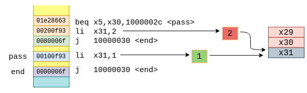

# Core and Peripheral Tests

These are self-checking tests that are run in both boot modes to cover specific instructions in the core and the testing of the peripherals:

## Testlist

* basic-ldst
* basic-test
* fcvt.wu
* fle.s
* fmul.s
* fsgnjx.s
* gpio
* gpio-intr
* gpio-plic
* pin-mux
* post-rom
* pwm
* spi-tx
* timer
* timer-tic
* uart-tx

## Testbench Structure

## Self-checking Functionality

Since all of the tests are self-checking, the basic functionality for getting the pass/fail status is implemented as a two step process:

**Step 1:** Near the end of the test, the result register is compared with a register pre-loaded with the expected value
**Step 2:** If the value is matched, the program jumps to the pass identifier in the assembly code. If the value is not matched, the program continues to execute.

The GPR `x31` is used as the status register for all the tests

